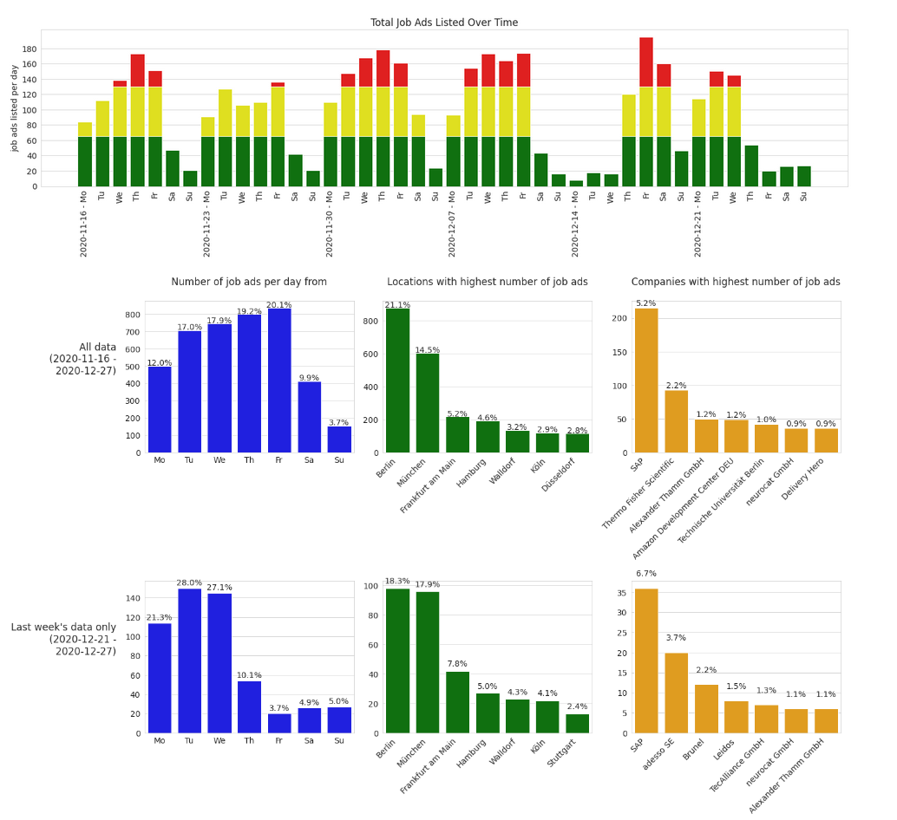

## Data Science Portfolio

Here are some projects I have worked on.

### [Analysing data science jobs listed on Indeed](https://nbviewer.jupyter.org/github/felix-datascience/indeed_job_analysis/blob/master/indeed_job_analysis.ipynb)

_Exploratory Data Analysis_

In this project I am analysing job ads from Indeed. The data is from another project ([https://github.com/felix-datascience/indeed_scraper](https://github.com/felix-datascience/indeed_scraper)) where I scraped job ads from an Indeed job search.

### [Interactive dashboard of data science jobs listed on Indeed](https://mybinder.org/v2/gh/felix-datascience/indeed_dashboard_deployed/main?urlpath=%2Fvoila%2Frender%2Findeed_dashboard.ipynb)

_Interactive dashboard_

This project is an extension of my [Analysing data science jobs on Indeed](https://nbviewer.jupyter.org/github/felix-datascience/indeed_job_analysis/blob/master/indeed_job_analysis.ipynb) project. It is a dashboard that displays information about data science jobs listed on Indeed through various plots. I have set up a Raspberry Pi which scrapes new job ads automaticly each week and pushes them to the projects Github Repository so that the data base grows over time. To make it more interesting and offer more perspectives on the data the dashboard is interactive.

### [Using machine learning to filter job ads](https://nbviewer.jupyter.org/github/felix-datascience/job_classifier/blob/main/job_classifier.ipynb)

_Machine Learning_

Here I am working with job ads from my other projects. When I was working on these other projects I realized that a lot of the job ads listed on a search for "data science" jobs were actually no data science jobs. I thought it would be useful to build a classifier that is able to filter wrong job ads so I started by labeling a lot of data and built and trained a classifier with that data.

