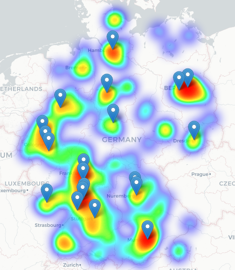
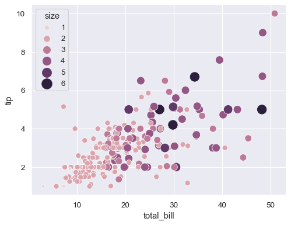

## Data Science Portfolio

Here are some projects I have worked on.

### [Analysing data science jobs on Indeed](https://nbviewer.jupyter.org/github/felix-datascience/indeed_job_analysis/blob/master/indeed_job_analysis.ipynb)

_Exploratory Data Analysis_

In this project I am analysing job ads from Indeed. The data is from another project ([https://github.com/felix-datascience/indeed_scraper](https://github.com/felix-datascience/indeed_scraper)) where I scraped job ads from an Indeed job search.

### Project 2

Duis aute irure dolor in reprehenderit in voluptate velit esse cillum dolore eu fugiat nulla pariatur. Excepteur sint occaecat cupidatat non proident, sunt in culpa qui officia deserunt mollit anim id est laborum.

### Project 3

Ut enim ad minim veniam, quis nostrud exercitation ullamco laboris nisi ut aliquip ex ea commodo consequat. Duis aute irure dolor in reprehenderit in voluptate velit esse cillum dolore eu fugiat nulla pariatur.

